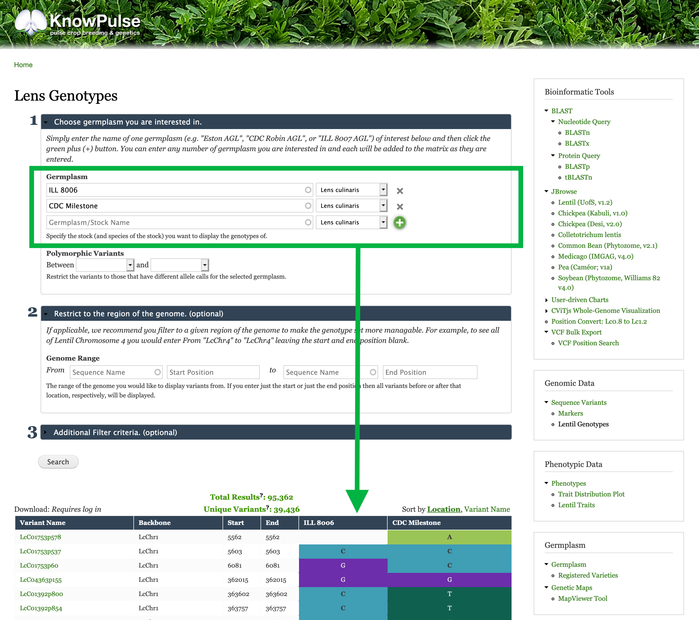

## Step #1: Go to the Lentil Genotype Matrix Tool
When you land on the Knowpulse home page https://knowpulse.usask.ca, click on "Genotypes" at the top of the page, this will scroll you down to the genotypes section. Then you can click on "Lentil Genotypes" to access the Lentil Genotype Matrix Tool on the same page.

## Step #2: Find genotypic data for your reference germplasm
Enter the name of each germplasm you are interested in by typing it in the textfield labelled germplasm, `ILL 8006` and `CDC Milestone` in this example. Make sure the correct species is selected to the right of the textbox. To add more then one germplasm, click the `green +` button.

After entering "ILL 8006" in the top germplasm textfield, you will notice that it autocompleted as you type. Then click the `green +` button and enter "CDC Milestone" in the second textfield which appears.
Each time you click the `green +` button or `search`, the genotypic data for the listed germplasm will be shown.

