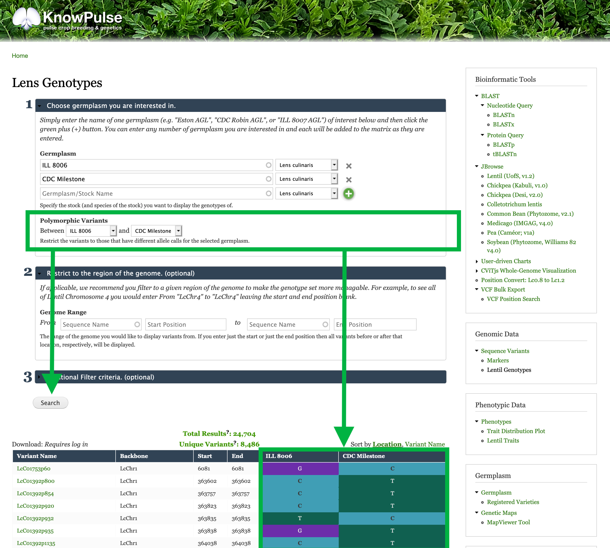
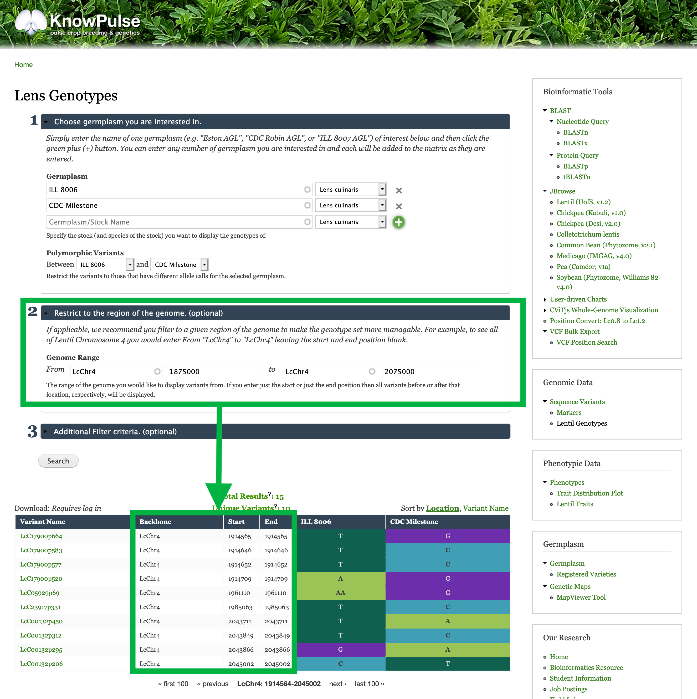

## Restrict the Sequence Variants to polymorphic between your germplasm
Underneath germplasm, there is a filter to restrict to polymorphic variants. This filter compares two germplasm and only shows variants with different genotypic calls.

For our example, we would select `ILL 8006` in the first drop down and `CDC Milestone` in the second drop-down to see only sequence variants with differing genotypes (i.e polymorphic variants) between these two germplasm.
Click Search to see the results.

## Restrict to your trait-implicated Region of the Genome
The second section of the filter criteria available for the genotype matrix allows you to enter the region of the genome you are interested in. Once you click search, the genotype matrix will only show sequence variants found in this region. 
In our example, the region of interest is `LcChr4:1875000-2075000`. To enter this, we place `LcChr4` for the `Sequence Name`, `1875000` for the start position and 2075000 for the end position.

