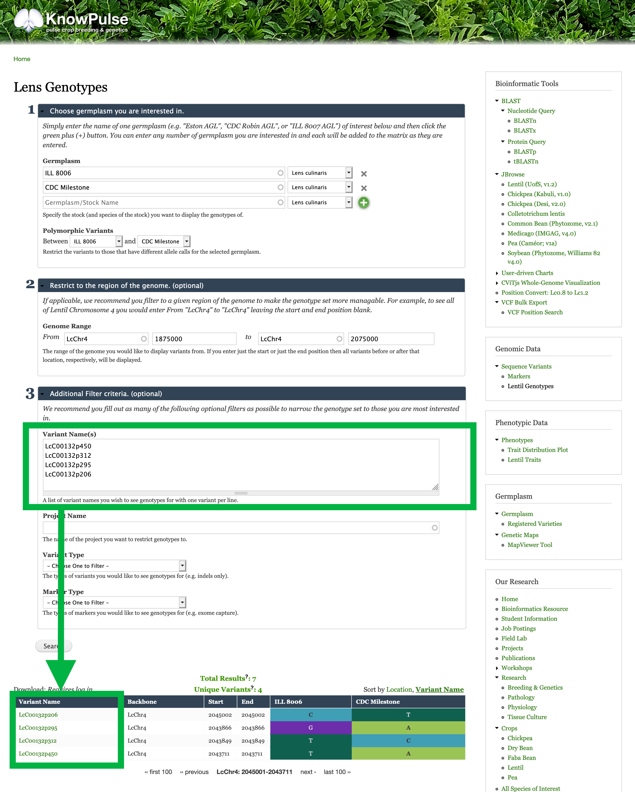

## (Optionally): Restrict to specific variants.
Say you are interested in a specific set of variants and would like to see that subset. You can enter the specific variant names by expanding the `Additional Filter criteria` section then clicking Search.

